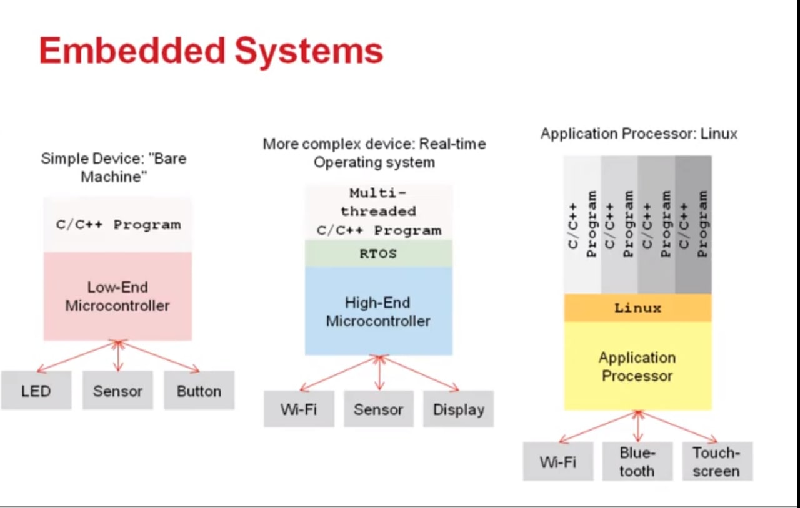

# Table of content
- [Table of content](#table-of-content)
- [Computer systems knowledge](#computer-systems-knowledge)
  - [Systems types](#systems-types)
    - [Bare metal](#bare-metal)
    - [RTOS](#rtos)
    - [Operating systems](#operating-systems)
# Computer systems knowledge

## Systems types

There is 3 basic type of computer systems

### Bare metal

[My notes](./docs/bare.md)

Just your own firmware written on low-level programing language.

There is [hardware abstraction layer (HAL)](https://en.wikipedia.org/wiki/Hardware_abstraction#In_operating_systems) libraries for most dev boards and chips.
Where you can easily reach the board and processor peripheries.

[More on wiki.](https://en.wikipedia.org/wiki/Bare_machine)

### RTOS

[My notes](./docs/rtos/README.md)

A real-time operating system is an operating system for real-time applications that processes data and events that have critically defined time constraints.

[More on wiki.](https://en.wikipedia.org/wiki/Real-time_operating_system)

### Operating systems

[My notes](./docs/oss/README.md)

Also notes:
 - [UNIX-LIKE](./docs/oss/unix-like/README.md)
   - [FreeBSD](./docs/oss/unix-like/bsd/README.md)
   - [Linux](./docs/oss/unix-like/linux/README.md)
   - [MacOS](./docs/oss/unix-like/mac/README.md)
 - [Windows](./docs/oss/win/README.md)