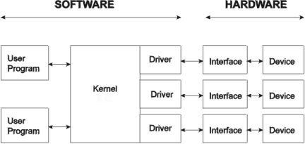

- [OS Architecture](#os-architecture)
	- [Drivers](#drivers)
	- [Kernels](#kernels)
		- [monolithic kernel structure:](#monolithic-kernel-structure)

# OS Architecture
big

## Drivers

##

## Kernels

### monolithic kernel structure:
- device tree
- drivers
- managers:
	- Memory
	- Process
	- virtual fs
	- IPC
	- IO
	- Network
- system call interface
