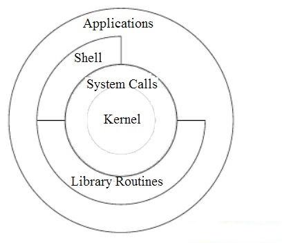

# FreeBSD

Official [site](https://www.freebsd.org/).

Read about FreeBSD on [wiki](https://en.wikipedia.org/wiki/FreeBSD).

All FreeBSD learning materials are on good official [docs site](https://docs.freebsd.org/en/).

## Arch

- (all open source)

