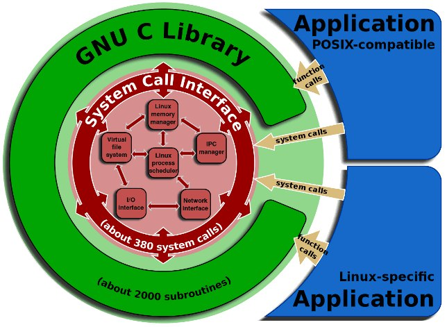
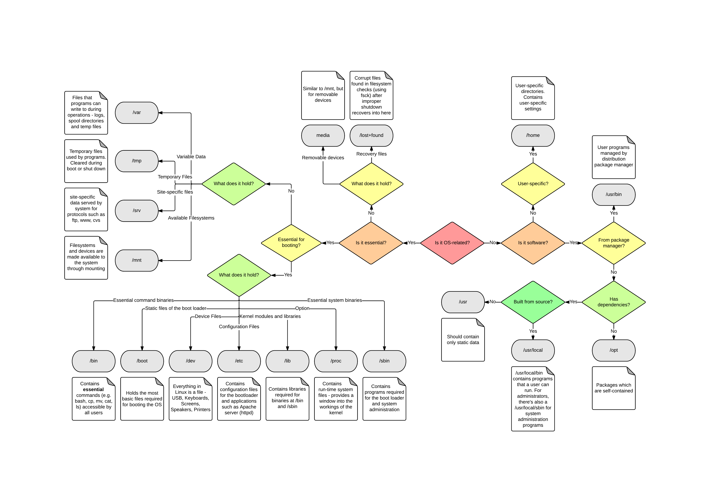

# Linux

Linux is not os it's just kernel for every one in free access.

Ready OS's  with Linux kernel, [desktop environment](https://en.wikipedia.org/wiki/Desktop_environment) and [package manager](https://en.wikipedia.org/wiki/Package_manager) is named [distros](https://en.wikipedia.org/wiki/Linux_distribution).

Official kernel [site](https://www.kernel.org/).

Debian distro official [site](https://www.debian.org/).

Read about Linux on [wiki](https://en.wikipedia.org/wiki/Linux).

Read about Linux distribution on [wiki](https://en.wikipedia.org/wiki/Linux_distribution).

Here is [list of books](books.md) about linux.

## Arch

## Boot

[Read note.](./boot.md)

## Folders logic

