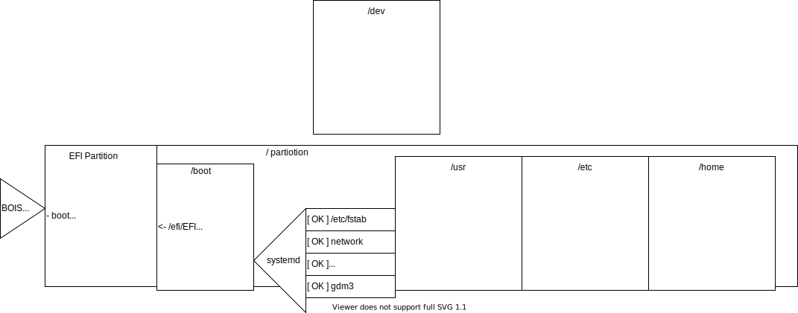
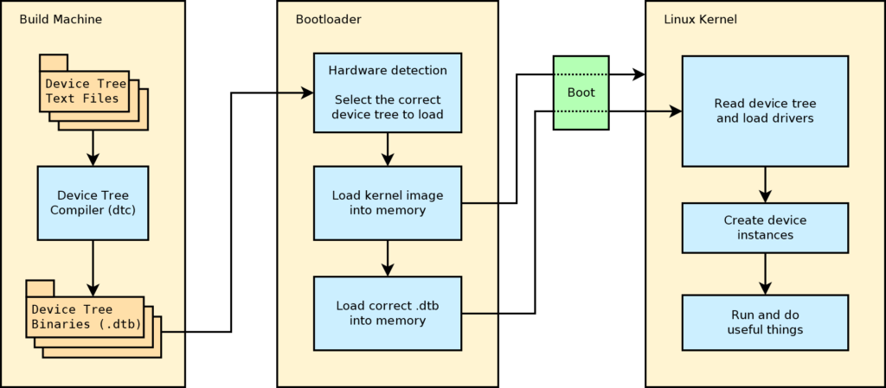

# How linux startups
```
->	EFI			BIOS
->	grub2(500)		GRUB(in 500MB)
->	/boot/grub2		GRUB2
```
```
->	/boot/*.dtb		device-tree-blob for embedded
+	/boot/vmlinuz		zipped kernel
+	/boot/initrd.img	initial ramdisk
->	kthreadd		kernel thread daemon
```
```
+	/usr/sbin/init		systemd (ln /usr/lib/systemd/systemd)
->	/
->	Network
->	pstree			daemons
```


## GRUB2 cli
```
linux /vmlinuz root=UUID=... # (='h0,_') (=/dev/sda)
initrd /initrd.img
boot
```

## The systemd startup map: 
``` bash
pstree
```


## rootfs + boot:
### Kernel space (DTB + kernel + rootfs)
```
/boot	- BOOT, *.dtb, vmlinuz, initd.img
/dev	- devices
/sys	- devices drivers kernel...
/proc	- proces like files
```
### User space (daemon + bins + libs)
```
/usr	- unix system resource bins libs
/etc	- configs for bins
/srv	- rules for sites
```
#### Daemons and programs files
```
/run	- runtime var dir for daemons
/tmp	- short time var file
/var	- long time var files like run tmp..
```

#### Users files
```
/root 	- root home
/home 	- users home
```

