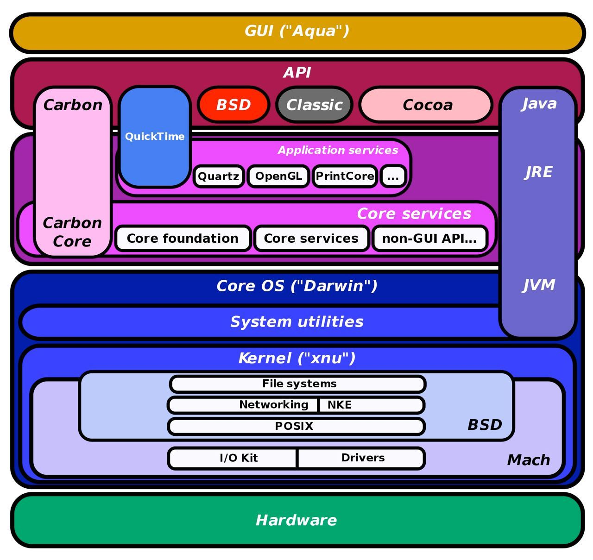

# MacOS

Official [site](https://www.apple.com/macos).

Read about MacOS on [wiki](https://en.wikipedia.org/wiki/MacOS).

## Arch

- [Aqua](https://en.wikipedia.org/wiki/Aqua_(user_interface)) (close source)
- [Darwin](https://en.wikipedia.org/wiki/Darwin_(operating_system)) OS (open source)
- [XNU](https://en.wikipedia.org/wiki/XNU) kernel (open source)

